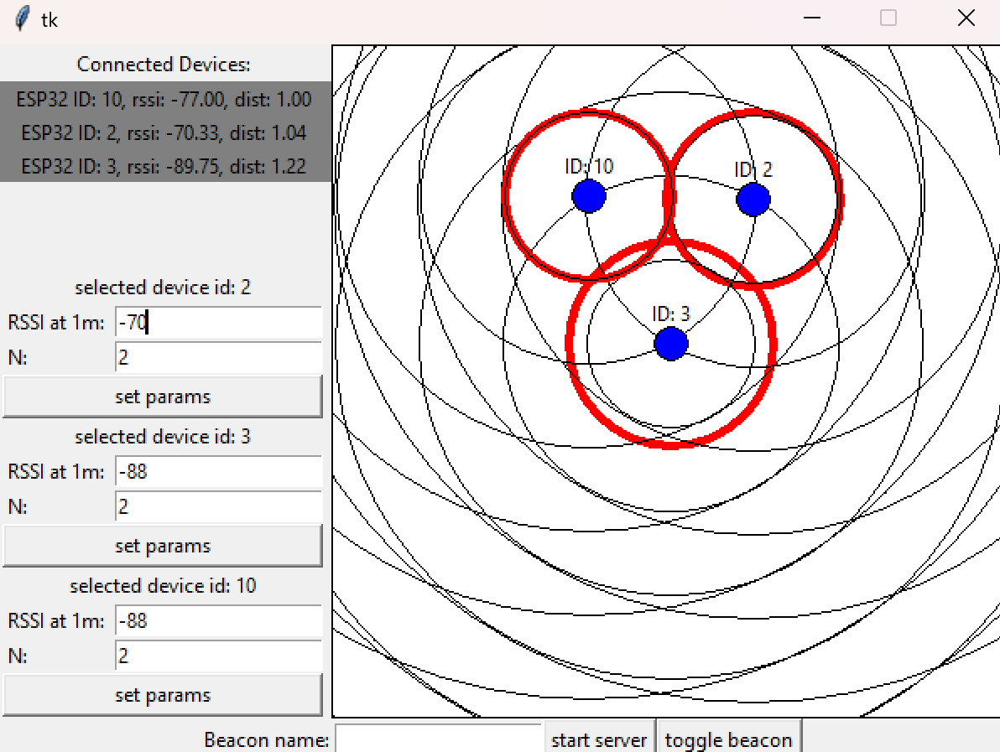
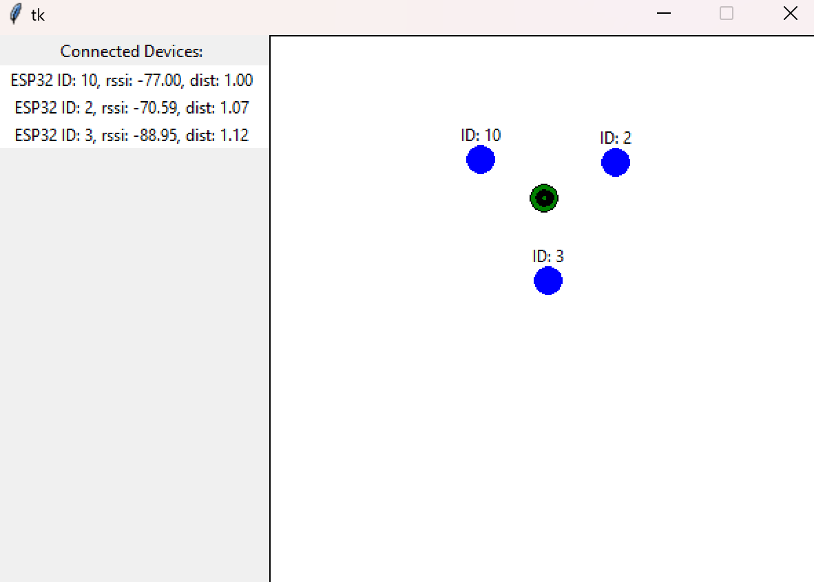

# bt_tracker
Projekt na przedmiot systemy wbudowane - Śledzenie lokalizacji nadajnika Bluetooth Low Energy (BLE) z wykorzystaniem esp32. 

## Opis projektu

Śledzenie lokalizacji obiektów na zamkniętym i niewielkim obszarze, takim jak pokój czy budynek (IPS - Indoor Positioning System), ma wiele zastosowań w przemyśle oraz rozwiązaniach typu Smart Home. W tym przypadku zastosowanie GPS-a, ze względu na ograniczenia tej technologii, nie pozwala na osiągnięcie zadowalających efektów. Systemy do śledzenia lokalizacji na takich obszarach wykorzystują zwykle inne technologie oparte na popularnych standardach, takich jak Wi-Fi, RFID, UWB czy BLE, i opierają się na analizie siły sygnału zarejestrowanego przez odbiornik (RSSI).

BLE to rozszerzenie klasycznego standardu Bluetooth, opracowane na potrzeby zmniejszenia zużycia energii przy zachowaniu podobnego zasięgu jak klasyczna wersja. Technologia BLE, dzięki niewielkiemu zużyciu energii, jest często wykorzystywana w systemach IPS (np. iBeacon).

Śledzenie lokalizacji nadajnika BLE jest możliwe na podstawie analizy siły sygnału emitowanego przez urządzenie, które ogłasza w regularnych interwałach protokołem BLE. Na podstawie RSSI odczytanego przez odbiorniki rozmieszczone w różnych miejscach na obszarze, w którym chcemy śledzić lokalizację, możliwe jest odczytanie odległości od każdego z odbiorników do nadajnika, a następnie określenie przybliżonej lokalizacji nadajnika przy pomocy metody trilateracji.
 

## Wykorzystane urządzenia

- ESP32 z ESP-WROOM-32 - pełniące role nadajnika BLE (role nadajnika może pełnić dowolne urządzenie wspierające BLE, które można zidentifikować na podstawie ogłaszanej nazwy)

- ESP32 z ESP-WROOM-32 x3 (lub więcej) - będące odbiornikami zczytującymi wartość RSSI ogłaszającego się nadajnika. 

- PC z systemem Windows 11, na którym działa serwer i z którym komunikują się odbiorniki. Musi znajdować się w tym samym VLAN co odbiorniki.

## Szczegóły projektu

### Serwer
Aplikacja serwera po uruchomieniu udostępnia użytkownikowi interfejs graficzny, pozwalający na konfigurację oraz wizualizację pozycji odbiorników i śledzonego nadajnika. Serwer po uruchomieniu zaczyna nasłuchiwać połączeń od odbiorników. Komunikacja między odbiornikami a serwerem odbywa się za pomocą protokołu TCP.

### Odbiorniki
Odbiornik ESP32 po uruchomieniu próbuje przyłączyć się do sieci. Następnie inizjalizuje moduł BLE i stara się zainicjować komunikację z serwerem. Jeżeli serwer jest uruchomiony to połączenie jest inicjalizowane a serwer przesyła odbiornikowi konfiguracje potrzebną do śledzenia nadajnika (nazwę ogłaszanego urządzenia). Następnie odbiornik regularnie skanuje urządzenia BLE i jeżeli wykrywa śledzone urządzenie to przesyła na serwer aktualne RSSI.

### Schemat


### Konwersja RSSI na metry

$ \text{DISTANCE} = 10^{(\text{MEASURED\_RSSI} - \text{RSSI})/(10 * N)} $

MEASURED\_RSSI - RSSI odczytane dla nadajnika w odległości 1 metra od odbiornika

N - stała zależna od środowiska, należy dostosować eksperymentalnie (Domyślnie N = 2)


### Redukcja błędu RSSI
Wartość RSSI odczytana bezpośrednio przez ESP32 jest podatna na szumy i zakłócenia w zależności od środowiska, w którym przeprowadzane są testy. Z powodu błędów pomiarowych wartości mogą się znacznie różnić między kolejnymi odczytami, co utrudnia dokładne określenie lokalizacji nadajnika. Aby zredukować wpływ błędów pomiarowych, zastosowany został filtr Kalmana, powszechnie stosowany estymator stanu, który estymuje wartość zmiennej na podstawie zakłóconego odczytu, biorąc pod uwagę poprzednie wartości i redukując w ten sposób błąd. (Zastosowanie filtra Kalmana dla RSSI: https://www.wouterbulten.nl/posts/kalman-filters-explained-removing-noise-from-rssi-signals/). 

### Obliczanie lokalizacji nadajnika
Obliczanie przybliżonej lokalizacji nadajnika na podstawie trzech lub większej liczby pomiarów (z każdego odbiornika) jest możliwe za pomocą metody trilateracji (https://www.alanzucconi.com/2017/03/13/positioning-and-trilateration/). Trilateracja pozwala na określenie punktu przecięcia trzech lub więcej okręgów (odbiornik jako środek okręgu, promień - odczytana odległość) lub znalezienie przybliżenia, jeżeli w wyniku błędu pomiaru odbiorników okręgi się nie przecinają (Wykorzystana biblioteka: https://pypi.org/project/easy-trilateration/).

## Implementacja

### Aplikacja serwera

Aplikacja serwera została napisana w języku Python 3.10. 

- tkinker (https://docs.python.org/3/library/tkinter.html) - Intefejsc graficzny

- easy_trilateration (https://pypi.org/project/easy-trilateration/) - Implementacja trilateracji 

### Odbiornik ESP32

ESP programowane było za pomocą Arduino IDE, wykorzystane biblioteki:

- ESP32 BLE Arduino (https://www.arduino.cc/reference/en/libraries/esp32-ble-arduino/)

- Arduino Wifi (https://www.arduino.cc/reference/en/libraries/wifi/) 

#### Inicjalizacja BLE

```
void init_ble_scanner() {
  BLEDevice::init("");
  pBLEScan = BLEDevice::getScan(); 
  pBLEScan->setAdvertisedDeviceCallbacks(new MyAdvertisedDeviceCallbacks(), true);
  pBLEScan->setActiveScan(true);
  pBLEScan->setInterval(100);
  pBLEScan->setWindow(99);
}
```

#### Łączenie z serwerem
```
bool initialize_conn_to_server() {
    Message msg;
    int res;

    if (!client.connect(host, port)) {
      Serial.printf("Could not connect to the hostname %s on port %d \n", host, port);
      return false;
    }

    msg.type = 1; 
    client.write((uint8_t*)&msg, sizeof(Message));
    int start = millis();
    MessageWithName msgName;
    while (client.available() < sizeof(MessageWithName)) {
      if (millis() - start > 1000) {
        Serial.printf("Timout on ACK from server \n");
        return false;
      }
    }

    res = client.read((uint8_t*)&msgName, sizeof(MessageWithName));
    Serial.printf("GOT BEACON NAME: %s\n", msgName.beacon_name);
    beacon_name = msgName.beacon_name;
    return true;
}

```

#### Odczytywanie wartości RSSI
```
class MyAdvertisedDeviceCallbacks: public BLEAdvertisedDeviceCallbacks {
    void onResult(BLEAdvertisedDevice advertisedDevice) {
      if (advertisedDevice.getName() == beacon_name) {
        Serial.printf("Advertised Device: %s \n", advertisedDevice.toString().c_str());
        rssi_to_send = advertisedDevice.getRSSI();
        pBLEScan->stop();
      }
    }
};
```

## Jak korzystać z systemu? 

1. Uruchomienie aplikacji serwera:
    ```
    $ python ./server/main.py
    ```
2. Ustawianie nazwy nadajnika, i uruchomienie serwera:


 - Nazwa musi odpowiadać tej ogłaszanej przez nadajnik.

3. Konfiguracja odbiorników:


- Kolejne promienie czarnych okręgów, to odległość 1m.
- Czerwony okrąg oznacza odczytywaną odległość od nadajnika.
- Należy tak dostosować parametry (RSSI at 1m i N) dla każdego odbiornika żeby dla nadajnika w odległości 1m od odbiornika czerwony okrąg pokrywał się z najmniejszym czarnym

Przykłądowe ustawienie dla 3 odbiorników ustawionych w trójkąt o bokach 2m:



4. Wyświetlania przybliżonej lokalizaji nadajnika:


Zielony marker oznacza pozycje nadajnika:




